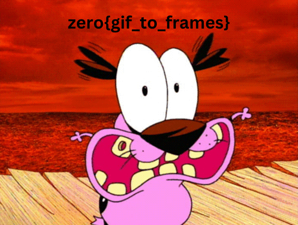

# zerodayCTF25

## This is the main writeup. To checkout the actual challenges and the files, you can look into this folder -> [folder](./Chalenges_zerodayCTF25/)


## Challenge: **Corrupted Courage**

### Description:

Courage tried to protect the flag… but corruption got to him.. Can you recover the flag?

### Tools:

xxd[to edit the hex files]

### Solution:

- Inspect the image and confirm that it is a png image.
- Edit the magick numbers in the header and fix the header all the way upto IHDR.
- Then view the image and the get the flag.

### Final Flag: zero{courage_the_brave_dog}

---

## Challenge: Canva

### Description:

Here is the poster design of ZeroDay CTF 2025

### Tools:

### Solution:

- First of all ,you can’t find anything at the surface level of your poster.
- Copy the poster onto your project and enjoy edit access.
- Peel off the element at the center mid.
- Increase the transparency and voila!

### Final Flag: zero{H1DD3N_1N_L4Y3RS}

---

## Challenge: **Flash**

### Description:

Courage the Cowardly Dog flashed something… (the flag, of course 👀). Are you quick enough?

### Tools:

ezgif.com

### Solution:

- Upload the gif file to ezgif and extract the frames.



### Final Flag: zero{gif_to_frames}

---

## Challenge: **Author**

### Description:

Can you find out about the author of this pdf?

### Tools:

exiftool

### Solution:

- Use exiftool on the pdf and see the author name.
- There is a base64 string which when decoded gives us the flag.

### Final Flag: zero{found_you_mr_author}

---

## Challenge: Guessing Game

### Description:

### Tools:

### Solution:

- Here, you have to guess a number between 1 to 100 using only 6 tries.
- Just apply the binary search algorithm and you will get the same.

### Final Flag:  zero{lucky_number_mastered}

---

## Challenge: **Paytm Karo**

### Description:

Scanning a QR will give you its contents. But what if... there were a hundred of them?

### Tools:

python

python qr reader

### Solution:

- The zip file gives you 100 qr images. You have to decode what does the qr say and base64 decode it and check if it is a flag.
- Decode script →
    - Script
        
        ```python
        import os
        from pyzbar.pyzbar import decode
        from PIL import Image
        import base64
        
        # Folder containing the QR images
        FOLDER_PATH = "qrcodes"       # change this to your folder name
        OUTPUT_FILE = "results.txt"
        
        def read_qr_codes(folder_path):
            results = []
            count = 0
        
            for filename in os.listdir(folder_path):
                if count >= 100:
                    break
        
                # Check for image extensions
                if filename.lower().endswith(('.png', '.jpg', '.jpeg', '.bmp', '.gif')):
                    img_path = os.path.join(folder_path, filename)
                    try:
                        img = Image.open(img_path)
                        decoded = decode(img)
                        if decoded:
                            for qr in decoded:
                                text = qr.data.decode('utf-8')
        
                                ans = base64.b64decode(text)
                                ans = ans.decode()
                                
                                text = ans
        
                                results.append(f"{filename}: {text}")
                        else:
                            results.append(f"{filename}: [No QR found]")
                    except Exception as e:
                        results.append(f"{filename}: [Error - {e}]")
                    count += 1
        
            return results
        
        def main():
            results = read_qr_codes("qr")
        
            with open(OUTPUT_FILE, "w", encoding="utf-8") as f:
                for line in results:
                    f.write(line + "\n")
        
            print(f"✅ Scanned {len(results)} images. Results saved in '{OUTPUT_FILE}'.")
        
        if __name__ == "__main__":
            main()
        
        ```
        

### Final Flag: zero{in_the_randomness_of_qr}

---

## Challenge: **Have the pin?**

### Description:

Give me the pin, I will give you the flag

### Tools:

### Solution:

- You can find the pin in the server.py.

### Final Flag: zero{r3alms_0f_r3v3rs3_3ngin33ring}

---

## Challenge: **Numbers to flag**

### Description:

I just see a bunch of numbers, how could this possibly be the flag?

### Tools:

python

### Solution:

- Use the reverse script to retrieve the flag.
    - Script
        
        ```python
        import urllib.parse
        
        def decode_encoded(digit_stream):
        
            n = len(digit_stream)
            memo = {}
        
            def backtrack(i):
                # returns list of chars from position i, or None if impossible
                if i == n:
                    return []
                if i in memo:
                    return memo[i]
        
                # try 4-digit then 3-digit (4-digit first handles larger values)
                for l in (4, 3):
                    if i + l <= n:
                        part = digit_stream[i:i + l]
                        # skip parts that start with '0' except "0" itself (not expected here)
                        if part.startswith('0'):
                            continue
                        val = int(part)
                        if val % 16 == 0:
                            ascii_val = val // 16 - 10
                            # sanity check: valid codepoint and printable-ish
                            if 0 <= ascii_val <= 0x10FFFF:
                                ch = chr(ascii_val)
                                rest = backtrack(i + l)
                                if rest is not None:
                                    memo[i] = [ch] + rest
                                    return memo[i]
        
                memo[i] = None
                return None
        
            result = backtrack(0)
            if result is None:
                raise ValueError("Could not parse the encoded string.")
            return ''.join(result)
        
        # Example usage:
        encoded_example = "21121776198419362128209619362032168017441984171217441872177617601680201618241776168017441936176017761680107215681232992100813762160"
        print(decode_encoded(encoded_example))
        # -> prints: zero{fakeflag}
        ```
        

### Final Flag: zero{you_cracked_the_code_9XC45L}

---

## Challenge: **sha256**

### Description:

I heard that hashes are uncrackable

### Tools:

hashcracking, crackstation.net

### Solution:

- Given hash → `e46a22f8d4c8855603b27e0cdb22ae4118d96ad5c934503188cbdfc854d66f95`

### Final Flag: zero{iambatman}

---

## Challenge: Layered Cipher

### Description:

A mysterious engineer left behind a Python script that transforms a secret flag into a strange sequence of characters.

### Tools:

python

### Solution:

- Use the reverse script and get the flag.
    - Script
        
        ```python
        import base64
        
        def rotr8(x, r):
            return ((x >> r) | (x << (8 - r))) & 0xFF
        
        def lcg_stream(seed, n):
            a = 1664525
            c = 1013904223
            m = 2**32
            s = seed & 0xFFFFFFFF
            out = []
            for _ in range(n):
                s = (a * s + c) % m
                out.append((s >> 16) & 0xFF)
            return out
        
        def decode_flag(encoded: str) -> str:
            # Pad base64 string if needed
            padded = encoded + '=' * (-len(encoded) % 4)
            data = base64.urlsafe_b64decode(padded)
        
            # Extract header
            L = data[0] | (data[1] << 8)
            payload = data[2:]
        
            # Regenerate keystream
            seed = (L * 0x9E3779B1) & 0xFFFFFFFF
            ks = lcg_stream(seed, len(payload))
        
            # XOR decryption
            rotated = bytes(b ^ k for b, k in zip(payload, ks))
        
            # Reverse rotation
            rev = bytes(rotr8(byte, (i % 7) + 1) for i, byte in enumerate(rotated))
        
            # Reverse byte order
            flag_bytes = rev[::-1]
        
            return flag_bytes.decode('utf-8')
        
        if __name__ == "__main__":
            enc = input("Enter encoded flag: ").strip()
            print(decode_flag(enc))
        
        ```
        

### Final Flag: zero{r3v3rs3d_and_x0red}

---

## Challenge: Cipher In Disguise

### Description:

Someone left behind a mysterious .txt file. At first glance, it looks harmless — but inside hides a secret message locked under layers of encoding and encryption.

### Tools:

Basic

### Solution:

- Decode the base64 string to get the RSA cipher breakables.
- Everything is given to crack the rsa.
    - Data
        
        ```python
        n = 14209931741331885160051434878217506599816400135893196297684883441492757150433472865928683236049270026260021077183370246903291738562459438329960705082191062727058184994414435436794765520613334918723727215542705679041154059720487666212124665072439113141604171591983952871841351337238360260180540484898615007212700541536040877760518668491203681295888784864752946621969434486194026068251511361712005013931124023248940417365975535023706413018152777964371359742852373464040815716395049281740445119958328309805713545523003132569897695701239033650534244160321792545776410818827968768999483581247833871504554585702296438522277
        e = 65537
        c = 13684562425465386747309120478401210114426077412463372238919046776116929700903364946039902924262215421626430655296637927893022738619783590271873197053319671204930414090999813844607483870696392356308338769483790151824098686741204355330030787619520080337262179201904268558082442842160143816652840802307989477977239178156572739047648639457177257815843427166180103555648599032104295812844626380469641376250356879562551779971127215427175110865238127477989630239273554465351186501332803113145966896039244823941414048680928681294286741367517149257994232768514121209737964462742365840266242157955706310353380795336202270274042
        d = 9075995739207033903208767758171820632035563014607829223565185101201539917298544954680695661653514717323316939588609413997053403184246908296898319331605592179866770918430716281624000029408633083034873392364650762454547321144390088346633601709984113355728962550450223282457346622907068100933781591427302525091265580549528827067077145259575047171954738571323996449277619403195555279634386445085283887623081132923651298003791843530675295643316982973204824447103596269102824129238030573300197329852074791729227008183398051949937020209397815417107699634070132468033562610200972440522206314301918278267649487141434507466373  
        ```
        

### Final Flag: zero{ea$y_RSA}

---

## Challenge: ROT 13

### Description:

They say cryptography is complicated but is it really? Maybe try giving this ROT13 twist a spin.

### Tools:

dcode.fr

### Solution:

- just put the code into rot 13 decoder

### Final Flag: zero{should_have_encrypted_3_times}

---

## Challenge: **Oversharer 2**

### Description:

Which mouse does the OP use?

Flag format: Mouse name and model eg. Razer Viper Mini

### Tools:

### Solution:

- Inspect the other posts of the reddit user.

### Final Flag: zero{Logitech_G_102}

---

## Challenge: **Oversharer**

### Description:

I found this post on reddit: [Reddit Post](https://www.reddit.com/r/indianrailways/comments/1oifcy5/indian_railways_punishes_punctuality/)

Can you find out where the OP is from?

OP → Original Poster

### Tools:

“Where is my train” APP

### Solution:

- Inspect the train place at the “where is my train app”.

### Final Flag: zero{fatehgarh}

---

## Challenge: **Just Google 2**

### Description:

I can't seem to remember where this music is from

### Tools:

### Solution:

- I opened the audio in vlc and it automatically shows the name of the show.
- You can also use exiftool in this case.

### Final Flag: zero{Steins;Gate}

---

## Challenge: **Doom scroller**

### Description:

I hate it when they don't mention the name of the show! #@!& [Link](https://www.youtube.com/shorts/kqC5tpyoad0)

### Tools:

### Solution:

- Veryfamous show → Modern Family

### Final Flag: zero{modern_family}

---

## Challenge: Just Google ?

### Description:

I hired a freelancer to build a website for my startup and he keeps on giving excuses. Today, he just texted me that he is on a vacation in Goa and sent me this picture. bro seriously????? It looks like it is download from google or smth, but can you prove it?

### Tools:

Google Lens

### Solution:

- Put the image in google lens and it will give the name of the beach

### Final Flag: zero{butterfly_beach}

---

## Challenge: **Feedback App**

### Description:

My sister vibe coded this feedback app, but it seems her ratings aren’t very high. Can you find a way to increase her average rating?

### Tools:

burpSuite

### Solution:

- Looking at the website redirection using burp.
- When a feedback is submitted to the website. It gives the response as average rating and message. The cookie authentication, let’s one user submit only one feedback.
- We manipulate the rating to be a very high value and see if it can handle that. The average rating is an error number.
- After submitting the feedback in the website, the website hits a post request to the `/reveal`  endpoint.
- If you do not do the integer overflow then, the endpoint shows, no flag for you. but if you do the integer overflow first, then the /reveal gives you the flag.

### Final Flag: zero{bright_feedback_success}

---

## Challenge: Rick You

### Description:

I have something for you.

### Tools:

cURL

### Solution:

- This website when visited, redirects the link to a youtube video.
- Simply curl the website to avoid redirection and get the flag which is present plainly in the website html.

### Final Flag: zero{wohoo_sherlock}

---

## Challenge: Root of all flags

### Description:

Welcome to the world of numbers! This website looks simple — just a few math problems to solve. But every correct answer brings you one step closer to uncovering the hidden clue that leads to the flag. Think logically, calculate carefully, and keep your eyes open… sometimes the numbers speak more than they seem.(the flag format for this challenge is zeroday{})

### Tools:

Basic

### Solution:

- Look through the sources of the webpage and find the flagparts.
- You can download the files and search each one or clone the repo and use grep.
- The flagparts contain a pastebin link, which contains the base64 string of an image.
- display the image to find the first part and the meta to find the second part.
- The text → bXJLYnFubHtxMGFnX2Z4MWNfejRndWZ9
- Base64 decode then rot13 decode → zeXoday{d0nt_sk1p_m4ths} [change the X to r]

### Final Flag: zeroday{d0nt_sk1p_m4ths}

---

## Challenge: **Picture Puzzle**

### Description:

Welcome to the gallery! The photos might look ordinary, but the real art lies in arranging them correctly. Shuffle the images, find the perfect order, and reveal the hidden code within the frames. Every picture tells a story — can you piece it together to find the flag?

### Tools:

Basic

### Solution:

- Scavenge the website to download the files and check the files for flagparts throughout the website.
- Also, as the website is hosted on github, you can clone the repo and grep it for the flag.
- flagparts found →
    
    ```python
    Challenge3/final-style.css:flag-oZSBzaH(position 6)
    Challenge3/final-script.js:flag-Zm9yIHR(position 1)
    Challenge3/script.js:flag-emVyb3t0(position 5)
    Challenge3/style.css:flag- bmd9(position 3)
    Challenge3/shuffle.html:flag-aGFua3Mg(position 4)
    Challenge3/shuffle-style.css:flag-VmZmxp(position 2)
    ```
    
- Rearrange the parts. Hint given in the website was to interchange the 5 → 1, 4→ 2.
- Base64 string - >emVyb3t0aGFua3MgZm9yIHRoZSBzaHVmZmxpbmd9

### Final Flag: zero{thanks_for_the_ shuffling}

---

## Challenge: **Directory of Dread**

### Description:

A cozy blog about Courage has gone a little weird — pages list pictures, but some secrets are written where humans don’t usually look. Explore the static folders and convince the app to reveal files it wasn’t meant to show. Find the flags and calm the dog.

### Tools:

Basic

### Solution:

- Just look through the local file system through the URL. I mean visit the /images endpoint and it shows the whole directory listing. There you can find the flag.

### Final Flag: zero{c0ur4ge_l34rns_LFI}

---

## Challenge: Levels

### Description:

Rise up the levels to get the flag

### Tools:

Basic

### Solution:

- Manipulate the url, to hit the level3 endpoint and get the flag.

### Final Flag: **zero{client_side_adventures_complete}**

---

## Challenge: Robots

### Description:

Thank god you can't find the flag by googling

### Tools:

Basic

### Solution:

- visit the /robots.txt
- You can see the hidden endpoint → `/secret5431`
- Hit the endpoint and you will get the flag.

### Final Flag: zero{consent_4_crawling}

---

## Challenge: httpMethods

### Description:

What options do you have, believe me bruteforcing is not required.

### Tools:

BurpSuite

### Solution:

- When you inspect the html in the website, you can see the hints given in the html.
- First hint points to the endpoint → `/flag`
- Second hint points to the username, that has to be sent to the website → `spider`
- Now, using burp capture the request and try out different methods. Here PUT method works with spider as username.

### Final Flag: zero{H77p_m3th0d5_m4tt3r5_3b4873b}

---

## Challenge: **Copy and Paste**

### Description:

 I'll be honest, I used ChatGpt to code this Calculator. I do know...."some" coding, but there appears to be a lot of stuff that I don't understand. I think its fine. I mean, if it works, it works, right?

### Tools:

### Solution:

- Inspect the website and you wil find a fishy function in the source.
- Function
    
    ```python
    (function (_0x3d7b37, _0x9db06d) {
        var _0x5b5850 = _0x1ae3,
            _0x7ddfb2 = _0x3d7b37();
        while (!![]) {
            try {
                var _0x1c310a =
                    (-parseInt(_0x5b5850(0x1c9)) / 0x1) * (-parseInt(_0x5b5850(0x1c5)) / 0x2) +
                    (-parseInt(_0x5b5850(0x1cc)) / 0x3) * (parseInt(_0x5b5850(0x1c8)) / 0x4) +
                    (parseInt(_0x5b5850(0x1cd)) / 0x5) * (parseInt(_0x5b5850(0x1ca)) / 0x6) +
                    (-parseInt(_0x5b5850(0x1c7)) / 0x7) * (-parseInt(_0x5b5850(0x1c3)) / 0x8) +
                    parseInt(_0x5b5850(0x1c6)) / 0x9 +
                    -parseInt(_0x5b5850(0x1c2)) / 0xa +
                    -parseInt(_0x5b5850(0x1c4)) / 0xb;
                if (_0x1c310a === _0x9db06d) break;
                else _0x7ddfb2["push"](_0x7ddfb2["shift"]());
            } catch (_0x5519f9) {
                _0x7ddfb2["push"](_0x7ddfb2["shift"]());
            }
        }
    })(_0x3961, 0x22726);
    function _0x1ae3(_0x249064, _0x12cce5) {
        var _0x3961c2 = _0x3961();
        return (
            (_0x1ae3 = function (_0x1ae3f6, _0x3803ad) {
                _0x1ae3f6 = _0x1ae3f6 - 0x1c2;
                var _0x3cf6d1 = _0x3961c2[_0x1ae3f6];
                return _0x3cf6d1;
            }),
            _0x1ae3(_0x249064, _0x12cce5)
        );
    }
    function printForgottenFunction() {
        var _0x4e5e4d = _0x1ae3;
        console[_0x4e5e4d(0x1cb)]("emVyb3thX2Z1bmN0aW9uX3dob21fbm9fb25lX3JlbWVtYmVyc30");
    }
    function _0x3961() {
        var _0x3451ec = [
            "1294282VUEIje",
            "4ZiLHHI",
            "2145600hQLYfI",
            "427819cGuPxf",
            "20KQfPzu",
            "45376lyIkKO",
            "148158AGTBOF",
            "log",
            "151971ghexnF",
            "25PLySdF",
            "1239270TNYvqy",
            "24dnPfAL",
        ];
        _0x3961 = function () {
            return _0x3451ec;
        };
        return _0x3961();
    }
    
    ```
    
- Here, you can find the base64 string, which is the flag in this context → `emVyb3thX2Z1bmN0aW9uX3dob21fbm9fb25lX3JlbWVtYmVyc30`

### Final Flag: zero{a_function_whom_no_one_remembers}

---

## Challenge: **Back in 90s**

### Description:

Lol, this is exactly how televisions were back in days.

### Tools:

Python

### Solution:

- In this challenge we have to construct an image from the byte stream given to us.
- For this we use a python script to do the following:
    - convert the 1s to “white blocks” and convert 0s to “spaces”
    - Python Script
        
        ```python
        cipher = """
        111111100100000110010111001111111
        100000101101100001100000001000001
        101110100111001010101100001011101
        101110101101000011100000001011101
        101110100010111100011111001011101
        100000101010011110100000001000001
        111111101010101010101010101111111
        000000000000110100101111000000000
        111110111110101101101110110101010
        010000001100000110010010010000011
        101101101101100000101010011001010
        100101000111001010010110111001111
        100001101101000011000010010011011
        000001001010111100111111111001101
        011101110010011110100110100101010
        100100011000110100011101001100101
        000001100010101101101110100011000
        000100000010000111010001011100111
        111110110011100000101100000000110
        100001000011001010011101011111110
        110011110001000001011001000011010
        110010001110111100101110011001101
        100000101110011110001100010011010
        100111000110110110011110100011101
        101111111100101011101001111111101
        000000001110000010010111100011011
        111111101011100101101111101011010
        100000100001001110101111100011101
        101110101111000101101110111111010
        101110101110111010011010110000111
        101110101110011101100011000001000
        100000101010110010100110011100100
        111111101100101101001001100101010
        """
        
        cipher = cipher.strip().splitlines() # puts every single line into an array as an element
        
        for line in cipher:
            print(''.join('█' if c == '1' else ' ' for c in line)) # reconstructs the whole thing but replaces the characters
        
        ```
        
- This gives us a qr which gives us the flag.

### Final Flag: zero{w0w_s0_y0u_r34Lly_f1Gur3_tH15_0u7_6c4d201a9e22fd}

---

## Challenge: Attachment

### Description:

Well, Wishes

### Tools:

Basic

### Solution:

- When see the contents in the file “pumpkin.eml”, you will see that it is an email file and has an attachment to it. This attachment is provided in the format of base64.
- Extract the base64 text and decode it to get an image.
- The image contains the the flag.

### Final Flag: zero{happy_halloween}

---
