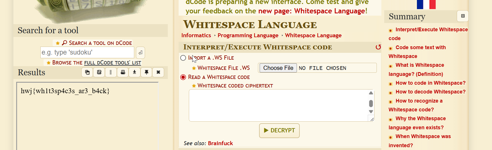
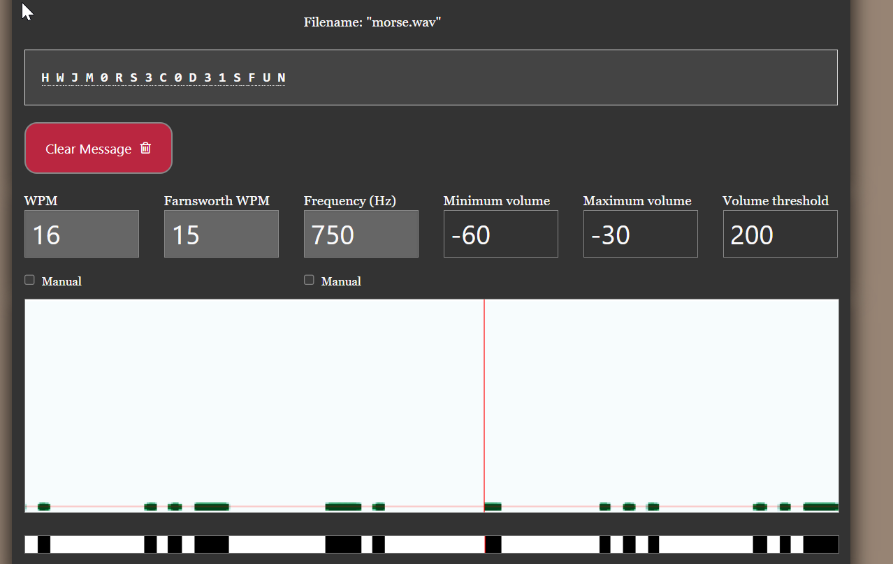
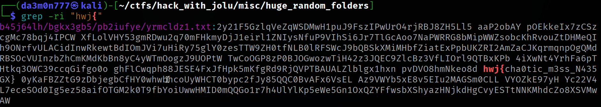
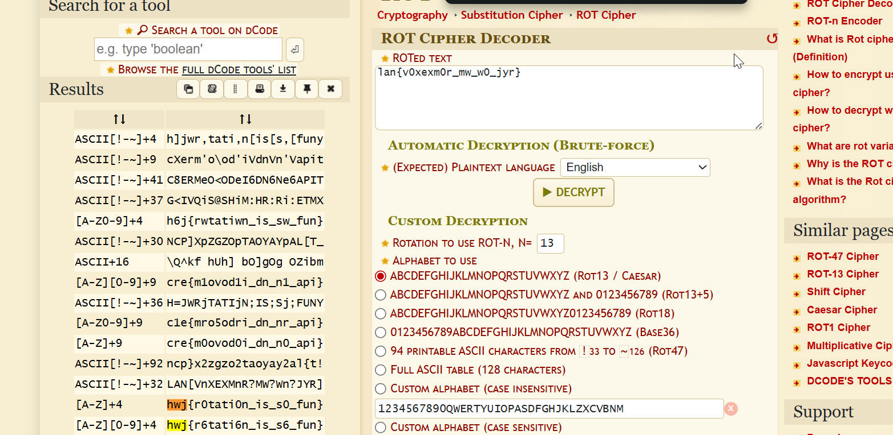

## Challenge: Simon says All the Best

### Description:

Category: Sanity
Points: 80
Prompt:
Howling winds clawed at the windows as dusk swallowed the village. Whispers
curled through the chimney, murmuring secrets too old for names. Just as Mira
bolted the door, she heard the soft knock again. Brace yourself, she thought,
clutching the rusted lantern with trembling fingers. Cold moonlight spilled
through the cracks as the door creaked open. Ashes scattered across the floor
where footprints once were. Reaching into her coat, she pulled out the torn
journal. Dust bloomed with every page she turned, its words faded but furious.
Inside, a sketch of a cardigan stared back at her—stitched, tagged, and ancient.
Guilt clawed at her as she remembered what she’d done that winter. All that
remained was to return it. Nightfall welcomed her steps as she vanished into the
hills, the wind carrying the cardigan’s curse once more}

### Initial Obs:

The challenge contained a lengthy, mysterious narrative paragraph. There were no files or
additional attachments, so the flag had to be embedded in the text itself. 

### Tools:

No tools 

### Solution:

We see the capitalised letters give us the flag. Writing down the apitalised letters of the flag, we get he whole flag HWJBCARDIGAN which translates to hwj{cardigan} 

### Final Flag: hwj{cardigan}

---

## Challenge: Quarterly Selections

### Description:

Category: Forensics / Document Analysis
Points: 150
Prompt:
This document was prepared by Arunima from the Design Team. She insisted
on using her minimalist aesthetic again. We gave up arguing. Please review the
report anyway, and let us know if you find anything meaningful. We didn’t.

### Initial Obs:

The provided file was a Word document (.docx). Based on the prompt, the document
appeared visually minimal or possibly even blank. The challenge hinted at the presence of
hidden or invisible content due to formatting or styling.

### Tools:

 Microsoft Word (to open the document) 

### Solution:

When we press ctrl + a on the word page, it reaveals specific part of the document,where our flag can be found which was white coloured and reduced to size. We find the flag → hwj{size_does_matter} 

### Final Flag: hwj{size_does_matter}

---

## Challenge: Unicode

### Description:

Category: Forensics / Steganography
Points: 288
Prompt:
Nothing suspicious here. Just a simple text you might read without thinking too
much.

### Initial Obs:

The file contained invisible characters which pointed to unicode steganography.  

### Tools:

[https://330k.github.io/misc_tools/unicode_steganography.html](https://330k.github.io/misc_tools/unicode_steganography.html)

### Solution:

When we out the text into this decoder, we get the decoded flag → hwj{z3r0_w1dth_1nv1s1bl3_m3ssag3}

### Final Flag: hwj{z3r0_w1dth_1nv1s1bl3_m3ssag3}

---

## Challenge:  Painting on the Wall

### Description:

Category: Forensics / Steganography
Points: 80
Prompt:
I dropped by an old friend’s place the other day, and something immediately
caught my eye.
Hanging on the wall, just above his study table, was a peculiar painting — one
I’d never seen before.
You know how in movies and old thrillers, paintings sometimes conceal
secrets—hidden safes, wads of cash, or something far more dangerous?
I couldn’t shake the feeling that this one was hiding more than just a blank wall
behind it.

### Initial Obs:

We get a hint at steganography. So we proceed with the basic recon steps  

### Tools:

steghide (to extract the data)

### Solution:

```python
steghide extract -sf painting.jpg -p 
```

When prompted with no password, the a file was extracted which contained the flag → hwj{h1dd3n_1n_pl41n_s1ght} 

### Final Flag: hwj{h1dd3n_1n_pl41n_s1ght}

---

## Challenge: Commitment Issue

### Description:

Category: Forensics / Steganography
Points: 20
Prompt:
My girlfriend thinks she knows me well, but even I don’t know about me
properly…
How well do you think you know me?

### Initial Obs:

We again get a hint at steganography. After a bit of osint, we find the phrase “askpolitely” which was the password to the file extraction using steghide

### Tools:

steghide (for file extraction from image)

### Solution:

```python
steghide extract -sf snorlaxx.jpg -p "askpolitely" 
```

This gives a file where the flag was stored, after reading it we get →  hwj{snorlax_keeps_dreaming_because_you_keep_overthinking}

### Final Flag: hwj{snorlax_keeps_dreaming_because_you_keep_overthinking}

---

## Challenge:  Droid Whisperer

### Description:

Category: Forensics / Mobile Forensics
Points: 300
Prompt:
A mysterious Android device image (.ad1) has surfaced, and rumor has it that
the owner’s WhatsApp chats hold the key to the flag.
Your mission: Mount, explore, and extract the truth from WhatsApp data.

### Initial Obs:

We are given an android device image which we have to find the flag from. It was clear you can found nothing before you have extracted the files from the diskimage. 

### Tools:

file (to verify file format)
binwalk (to extract embedded files)
Custom Python script (for decompressing Zlib streams)
grep (for string filtering)

### Solution:

Verified File Type:
Ran the file command:

bash
Copy code
file android_image.ad1
Output:

kotlin
Copy code
android_image.ad1: data
1.

Extracted Embedded Content:
Used binwalk to analyze the image and extract files:

bash
Copy code
binwalk --extract android_image.ad1
2.  This produced multiple zlib-compressed files in the
_android_image.ad1.extracted/ directory.

Decompressed Zlib Data:
Used a Python script to recursively decompress all .zlib files and store the outputs in a
directory named zlib_output:

Python Script:

python:
import zlib
import os

input_dir = "./_android_image.ad1.extracted"
output_dir = "./zlib_output"
os.makedirs(output_dir, exist_ok=True)

index = 0
for root, dirs, files in os.walk(input_dir):
for filename in files:
filepath = os.path.join(root, filename)
with open(filepath, 'rb') as f:
data = f.read()
try:
decompressed = zlib.decompress(data)
output_path = os.path.join(output_dir,
f"{index}.out")
with open(output_path, 'wb') as out:
out.write(decompressed)
index += 1
except Exception:
continue
3.

Searched for the Flag:
After decompression, searched for flag-like strings:

bash
Copy code
strings *.out | grep -i "hwj"
4.

Recovered Flag:
The following flag was identified in one of the .out files:

Copy code
hwj{ANDR01D_ART1F4CT5_D3C0D3D}

### Final Flag: hwj{ANDR01D_ART1F4CT5_D3C0D3D}

---

## Challenge: Locked Flag

### Description:

Category: Forensics / Steganography
Points: 219
Prompt:
You have a locked flag. Don't lose the key you found, it is not the answer but it
will take you to your answer.

### Initial Obs:

Again we can predict this is a stego challenge from the image file provided. Also the prompt implies this time the file is password-locked.

### Tools:

exiftool (to find the key)

steghide (to extract the text)

### Solution:

```python
exiftool file.jpeg -> we get the key "hwj{this_is_your_key}"
```

We use this key to run 

```python
steghide extract -sf lockedflag.jpeg -p "hwj{this_is_your_key}" 
```

After extracting, we get a file which has the flag → hwj{m3t4_is_the_k3y}

### Final Flag: hwj{m3t4_is_the_k3y}

---

## Challenge: Hidden Text

### Description:

Category: Forensics / Steganography
Points: 90
Prompt:
You caught an encrypted message. But they were not so good at hiding it.

### Initial Obs:

The provided file was found blank but when you press ctrl A, you see the presence of the characters. This is whitespace encoding. 

### Tools:

[https://www.dcode.fr/whitespace-language](https://www.dcode.fr/whitespace-language) → online decoder

### Solution:



### Final Flag: hwj{wh1t3sp4c3s_ar3_b4ck}

---

## Challenge: Are you blind ?

### Description:

Category: Forensics / Steganography / Metadata
Points: 80
Prompt:
You can read the flag only if you are blind
Flag Format: hwj{flag}

### Initial Obs:

The challenge hints to steganography. we get a file without any extension. After running file command we get that it’s a png file

### Tools:

zsteg (to find the hidden data) 

### Solution:

When we run 

```python
zsteg file.jpg
```

we get meta label: text→ icanseebrl

Assuming this was the flag content…. it worked

### Final Flag: hwj{icanseebrl}

---

## Challenge: Hidden Pixels

### Description:

Category: Forensics / Steganography
Points: 80
Prompt:
This image looks so innocent, but are you sure?
ENTER in the pixel level!

### Initial Obs:

We can easily understand from the description that this is a stegochallenge.

### Tools:

steghide (for steganography file extraction) 

### Solution:

```python
steghide extract -sf pixel.jpg
```

When i prompted the file without any password, it gave a file called pixel.txt. After 

```python
cat pixel.txt
```

We retrieve the flag → hwj{pixe1s_n3v3r_1ie} 

### Final Flag: hwj{pixe1s_n3v3r_1ie}

---

## Challenge: Zip Brute

### Description:

Category: Forensics / Password Cracking
Points: 150
Prompt:
You’ve stumbled upon an old zip file. There’s a problem — the creator forgot the
password.
Somewhere in the depths of time, the key was lost, leaving only this locked file
behind.
The contents are said to hold something valuable, but without the right
combination, it’s just a digital vault mocking you.
Can you figure out how to unlock its secrets and reveal what’s inside?

### Initial Obs:

This is a locked zip file. So, from the title we can guess that we have to brute force the password. 

### Tools:

unzip (Linux terminal)
zip2john (for converting ZIP hash)
john (John the Ripper) — for password brute-force

### Solution:

```python
zip2john protected.zip > hash.txt
john --wordlist=/usr/share/wordlists/rockyou.txt hash.txt
```

Password retrieved from john → idontknow

Using the password we unlock the file and find a text file called flag.txt which contains the flag → hwj{brute_forced_FN2FB923}

### Final Flag: hwj{brute_forced_FN2FB923}

---

## Challenge: Beep Beep

### Description:

Category: Forensics / Audio
Points: 120
Prompt:
Found a strange audio transmission. What is it?
Every letter in the decoded message is lowercase, and words are separated by
underscores (_).
Flag format: hwj{...}
Example: hwj{fak3_f1ag}

### Initial Obs:

The provided file was a .wav file. After one hear, you can predict its morse code.

### Tools:

[https://morsecode.world/international/decoder/audio-decoder-adaptive.html](https://morsecode.world/international/decoder/audio-decoder-adaptive.html)

### Solution:



Text decoded →  **H W J M 0 R S 3 C 0 D 3 1 S F U N**

### Final Flag: hwj{m0rs3_c0d3_1s_fun}

---

## Challenge: My Desktop

### Description:

Category: Forensics
Points: 80
Prompt:
Hey! The file you were looking for is in my desktop (somewhere...)

### Initial Obs:

This was a zip file. And from the prompt we can guess that the flag is hidden somewhere between the folder. 

### Tools:

unzip (Linux terminal)
grep (for pattern search)
Command-line navigation (cd, ls, etc.)

### Solution:

```python
unzip My_Desktop.zip
```

We get a bunch of txt files. 

Then searching recursively through the text files….

```python
grep -ir "hwj{"
```



### Final Flag: hwj{cha0tic_m3ss_N435GX}

---

## Challenge: Rotation

### Description:

Category: Forensics / Steganography
Points: 50
Prompt:
Look! It is rotating. Are your eyes fast enough?
Note: There are no uppercase letters, those are numbers.

### Initial Obs:

A certain code is flashed in a frame in the gif which might be a possible cipher which leads to the flag. 

### Tools:

[ezgif.com](http://ezgif.com) → To extract frames from the gif

google lens → For getting the text from the image

[https://www.dcode.fr/rot-cipher](https://www.dcode.fr/rot-cipher) → To decode the cipher

### Solution:


Text recovered: **lan{v0xexm0r_mw_w0_jyr}**

Decoding it in [dcode.fr](http://dcode.fr) → 



Hence revored flag → hwj{r0tati0n_is_s0_fun}

### Final Flag: hwj{r0tati0n_is_s0_fun}

Category: Forensics / Steganography
Points: 50
Prompt:
Look! It is rotating. Are your eyes fast enough?
Note: There are no uppercase letters, those are numbers.
