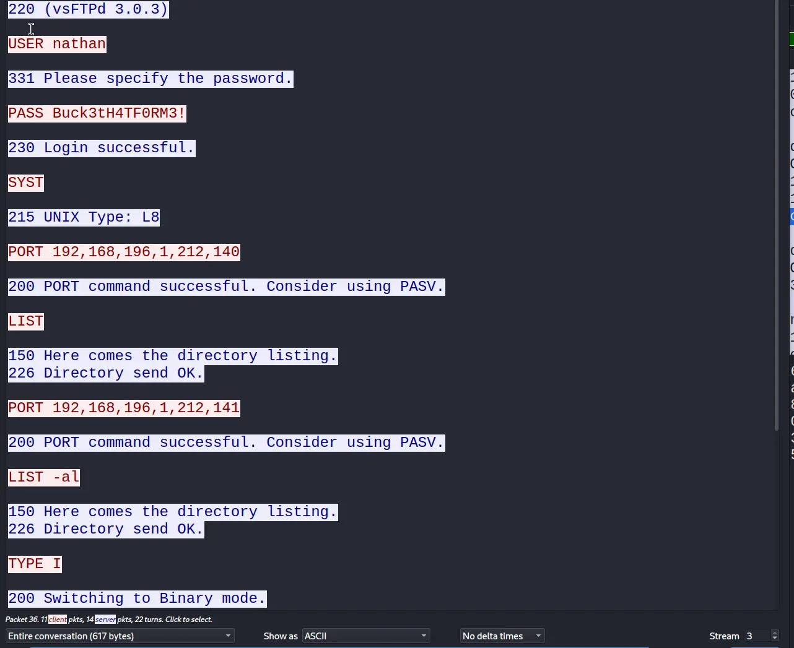
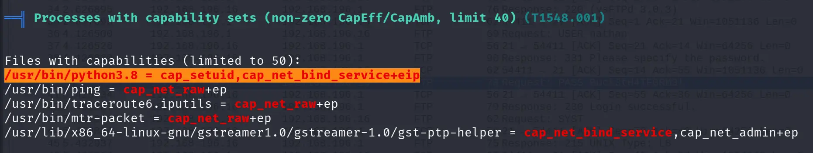
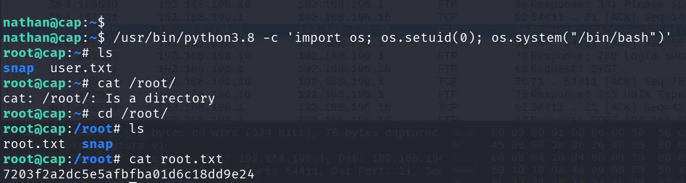

# nmap

21/tcp open  ftp     vsftpd 3.0.3
22/tcp open  ssh     OpenSSH 8.2p1 Ubuntu 4ubuntu0.2 (Ubuntu Linux; protocol 2.0)
| ssh-hostkey: 
|   3072 fa:80:a9:b2:ca:3b:88:69:a4:28:9e:39:0d:27:d5:75 (RSA)
|   256 96:d8:f8:e3:e8:f7:71:36:c5:49:d5:9d:b6:a4:c9:0c (ECDSA)
|_  256 3f:d0:ff:91:eb:3b:f6:e1:9f:2e:8d:de:b3:de:b2:18 (ED25519)
80/tcp open  http    Gunicorn
|_http-title: Security Dashboard
|_http-server-header: gunicorn
Service Info: OSs: Unix, Linux; CPE: cpe:/o:linux:linux_kernel

# Solution

## 21/ ftp

vsftpd 3.0.3 vulnerable to DDOS -> https://nvd.nist.gov/vuln/detail/CVE-2021-30047

## 80/tcp http

Found a website hosted here. 

Found a idor vulnerability at network inspect section and got a pcap file at data/0 which had ftp credentials

After logging in through ftp found user.txt ...
user.txt -> 92961939fbe273203b5e4182989fabdf

the password obtained also worked for ssh and we got in. 

After searching with linpeas i got this...

