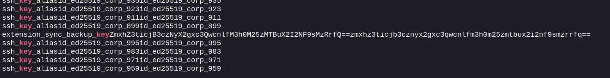
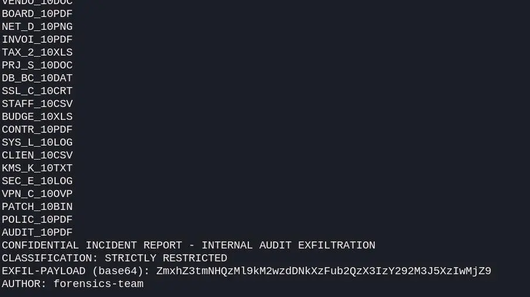

# Chall: Browser Forensics


| Field    | Value      |
| -------- | ---------- |
| Category | Forensics  |
| Date     | 2026-08-15 |

---

## Description

```text

A rogue employee is suspected of using a malicious Chromium extension to store exfiltrated sensitive tokens inside the browser profile prior to resigning. Investigators seized the employee's Chromium profile directory. Your objective is to examine the SQLite databases within the profile to recover the hidden flag.

```

---
## Solution

- Tried to view the databases one by one but there was a huge amount of data so, it was not possible.
- Searching the databases for keywords like "admin, flag, trivarna, key", We get a hit on a key which contained a base64 blob which when decoded gave the answer.
- Found blob----
	
- Extracted blob: ZmxhZ3ticjB3czNyX2gxc3QwcnlfM3h0M25zMTBuX2I2NF9sMzRrfQ==
- Decode to get flag -> flag{br0ws3r_h1st0ry_3xt3ns10n_b64_l34k}
---
## Flag

```
TRIVARNA{br0ws3r_h1st0ry_3xt3ns10n_b64_l34k}
```

---


# Chall: Deleted File Recovery


| Field    | Value       |
| -------- | ---------- |
| Category Forensics  s  |
| Date     | 2026-08     |

---

## Description

```text

A suspect under investigation for leaking confidential documents deleted a critical report from a USB flash drive immediately before it was seized by forensic analysts. Investigators took a full raw disk image of the drive. Your task is to analyze the filesystem evidence, locate the deleted file, and recover the flag inside.

```

---
## Solution

Run strings on the given image after unzipping and it gives a b64 blob at the end which is the encoded flag.



b64 blob: ZmxhZ3tmNHQzMl9kM2wzdDNkXzFub2QzX3IzY292M3J5XzIwMjZ9
Decoded: flag{f4t32_d3l3t3d_1nod3_r3cov3ry_2026}

---
## Flag

```
TRIVARNA{f4t32_d3l3t3d_1nod3_r3cov3ry_2026}
```

---

# Chall: Sensor Fusion


| Field    | Value      |
| -------- | ---------- |
| Category | Forensics  |
| Date     | 2026-08-15 |

---

## Description

```text
A building-automation vendor's cloud export bundle leaked: raw sensor telemetry, a device registry database, and a per-device config file. Nothing here is individually suspicious. Correlated correctly, one device's telemetry stream is a covert channel.


```

---

## Solution

After reviewing the device_config.json, we can observe that the device id being used is 1021. 
We map the id from the sqlite database and find that it is covert_carrier.
Now to view the telemetry data of the specific device id. We use thsi command : 
```bash
cat telemetry.csv | grep ",1021,"
```

Now looking at the last digit of the telemetry data, we can see that it is a bit stream. We create the bitstream by even for 0 and odd for 1. After decoding teh full bit stream separate the data into 8 bit chunks and then convert to ascii  which gives us the flag.


---
## Flag

```
flag{}
```

---

## Lessons Learned

- New techniques
- Mistakes
- Tools discovered

---

## References

- https://...
- https://...